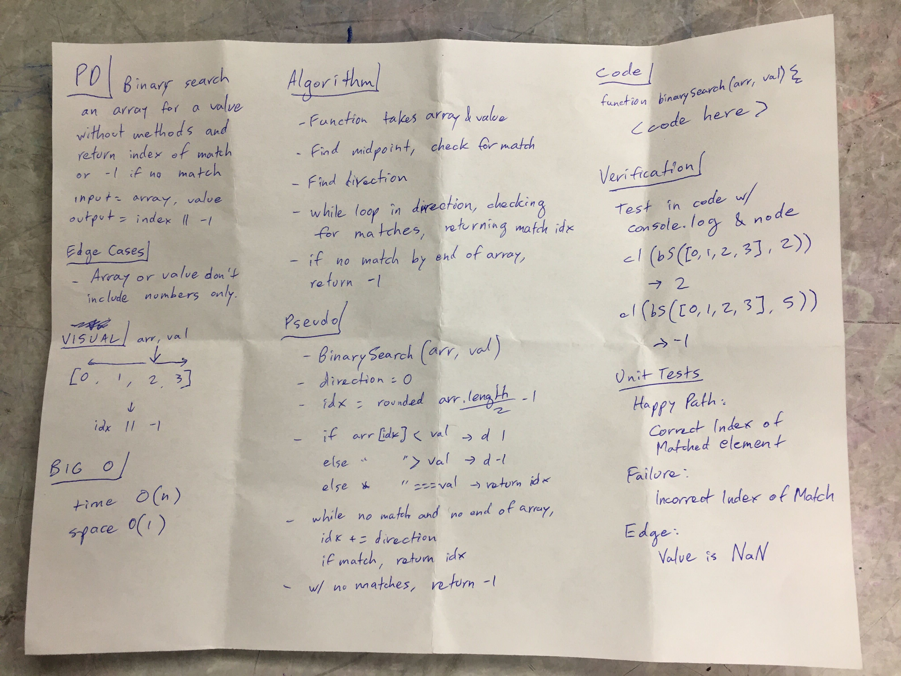

# Challenge Summary
<!-- Short summary or background information -->
- Search an array for a value without using methods

## Challenge Description
<!-- Description of the challenge -->
- Write a function called BinarySearch which takes in 2 parameters: a sorted array and the search key. Without utilizing any of the built-in methods available to your language, return the index of the array’s element that is equal to the search key, or -1 if the element does not exist.

## Approach & Efficiency
<!-- What approach did you take? Why? What is the Big O space/time for this approach? -->
- Approach
  - Pass array and value into function
  - Declare a direction value
  - Find and declare midpoint
  - Check if the midpoint matches the value
  - Detect direction based on left and right of midpoint
  - While-loop to go in the direction until array end and test for match
  - Test with `node` and `console.log`, then unit tests
- Big 0
  - 0(1) 0(n)

## Solution
<!-- Embedded whiteboard image -->

