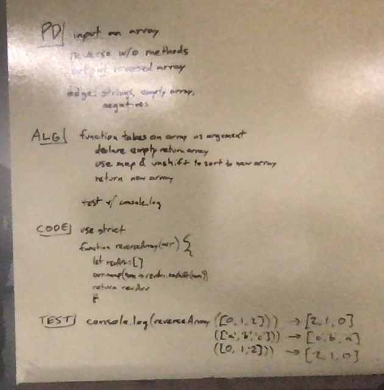

# Reverse an Array
<!-- Short summary or background information -->
- Reverse an Array without .reverse()

## Challenge
<!-- Description of the challenge -->
- Write a function called reverseArray which takes an array as an argument. Without utilizing any of the built-in methods available to your language, return an array with elements in reversed order.

## Approach & Efficiency
<!-- What approach did you take? Why? What is the Big O space/time for this approach? -->
- Used map, unshift and the single-responsibility principle
- Big O is small and short
- Tested with `console.log` and `% node array-reverse.js`

## Solution
<!-- Embedded whiteboard image -->
 "array-reverse whiteboard")
