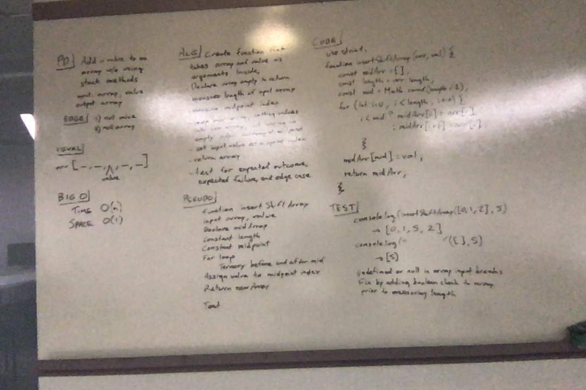

# Challenge Summary
<!-- Short summary or background information -->
- Add a value to the middle of your array without the stock method

## Challenge Description
<!-- Description of the challenge -->
- Write a function called insertShiftArray which takes in an array and the value to be added. Without utilizing any of the built-in methods available to your language, return an array with the new value added at the middle index.

## Approach & Efficiency
<!-- What approach did you take? Why? What is the Big O space/time for this approach? -->
- Approach
  - Count the elements in the array
  - Divide by 2 and round up if the total was odd
  - Iterate over the array, assigning them to the new array around the middle empty index
  - Assign the given value to the empty middle empty index
  - Return the array
  - Test with `node` and `console.log`, then unit tests
- Big 0
  - Small and short

## Solution
<!-- Embedded whiteboard image -->

