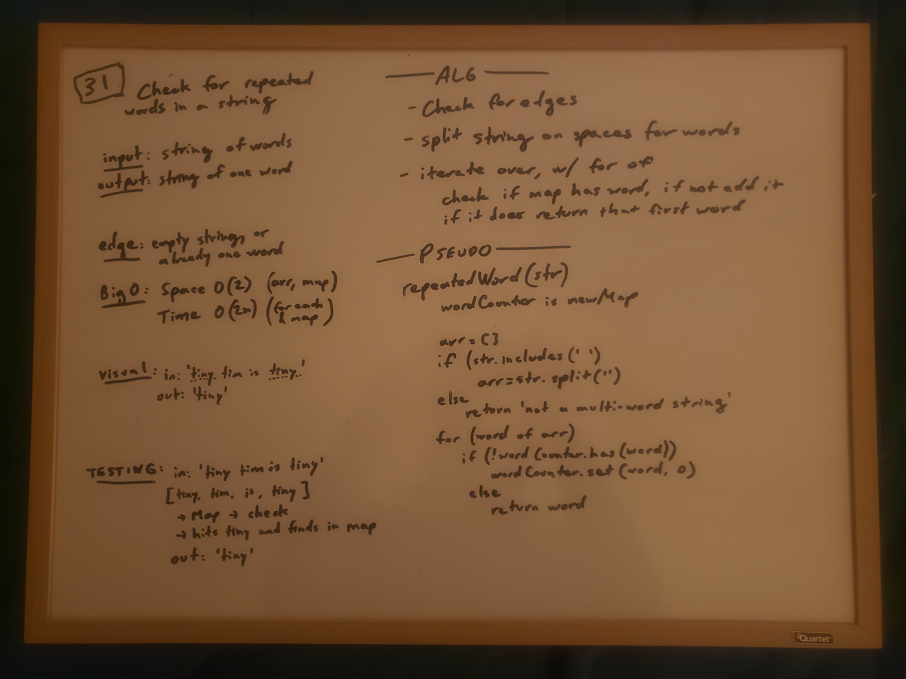

# Code Challenge 31 - Repeated Word
- Check for repeated words in a string

## Challenge Description
- Write a function that accepts a lengthy string parameter
- Without utilizing any built-in library methods, return the first word to occur more than once in that provided string

## Approach & Efficiency
- Split the string into an array of words
- Create new map and set word to it as the key, with value 0
- Iterate over, using the value as the counter
- If it is in the map, return the key
- O(2) O(2n)

## Solution

